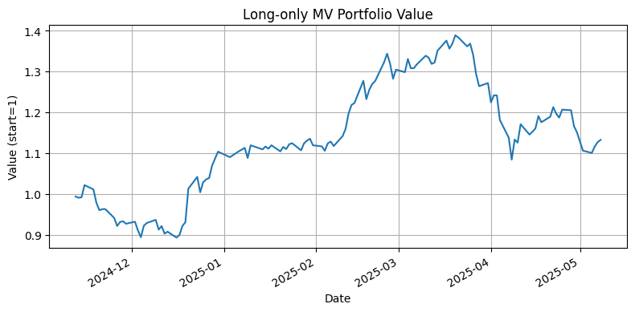

## Задача по Quantitative Research
---
1) Загрузите котировки акций-голубых фишек российского рынка за последние полгода.
2) Скорректируйте котировки на сплиты.
3) Постройте Mean-Variance Portfolio из акций, загруженных ранее, и оцените его динамику.

**Условия к файлу:**
Результат должен быть представлен в Google colab, Jupyter notebook или Python скрипте.

---

**Инструменты**
- Python 3.10+  
- `pandas`, `numpy`  
- ISS Statistics API  
- `scikit-learn` (LedoitWolf)  
- `cvxpy`  
- `matplotlib`

**Решение:**
- Выгружаем список голубых фишек IMOEX через ISS statistics API их "сырые" цены и проверяем, были ли сплиты в нашем диапозоне.
- Для постройки MVP метод **LedoitWolf** библиотеки sklearn.

**Анализ ковариации и доходностей:**
```python
# returns — DataFrame с ежедневными доходностями акций
# tickers — список или Index тикеров
# 5. Covariance & expected returns
lw = LedoitWolf().fit(returns)
Sigma = pd.DataFrame(lw.covariance_, index=returns.columns, columns=returns.columns) * 252
mu = returns.mean() * 252
```
**Формулировка и решение MV-задачи:**
```python
# 6. Long-only MV оптимизация
n = len(tickers)
w = cp.Variable(n)
lam = 0.1
objective = cp.Maximize(mu.values @ w - lam * cp.quad_form(w, Sigma.values))
constraints = [cp.sum(w)==1, w>=0, w<=0.2]
prob = cp.Problem(objective, constraints)
prob.solve()
w_opt = pd.Series(w.value, index=tickers)
print("Long-only MV weights:\n", w_opt.round(4))
```

Ниже показан график поведения портфеля и его метрики за 6 месяцев.
---


**Cumulative return:** 1.1323

**Annualized Return:** 0.3075, **Volatility:** 0.3336, **Sharpe:** 0.9218
